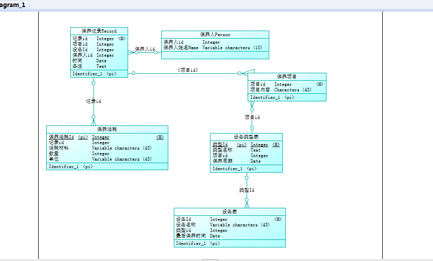
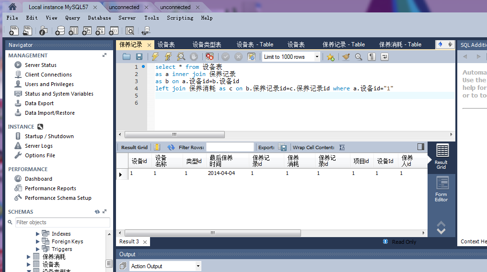
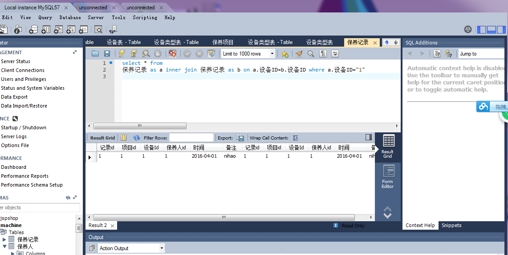

# 电气设备汇总
##1、ER图

##2、数据库
DROP TABLE IF EXISTS `保养记录`;
/*!40101 SET @saved_cs_client     = @@character_set_client */;
/*!40101 SET character_set_client = utf8 */;
CREATE TABLE `保养记录` (
  `记录id` int(11) NOT NULL,
  `项目id` int(11) NOT NULL,
  `设备Id` int(11) NOT NULL,
  `保养人id` int(11) NOT NULL,
  `时间` date NOT NULL,
  `备注` text NOT NULL,
  PRIMARY KEY (`记录id`)
) ENGINE=InnoDB DEFAULT CHARSET=utf8;
/*!40101 SET character_set_client = @saved_cs_client */;

Dumping data for table `保养记录`

LOCK TABLES `保养记录` WRITE;
/*!40000 ALTER TABLE `保养记录` DISABLE KEYS */;
/*!40000 ALTER TABLE `保养记录` ENABLE KEYS */;
UNLOCK TABLES;

DROP TABLE IF EXISTS `设备类型表`;
/*!40101 SET @saved_cs_client     = @@character_set_client */;
/*!40101 SET character_set_client = utf8 */;
CREATE TABLE `设备类型表` (
  `类型id` int(11) NOT NULL,
  `项目id` int(11) NOT NULL,
  `类型名称` text(45) NOT NULL,
  `保养周期` date NOT NULL,
  PRIMARY KEY (`类型id`)
) ENGINE=InnoDB DEFAULT CHARSET=utf8;
/*!40101 SET character_set_client = @saved_cs_client */;

Dumping data for table `设备类型表`

LOCK TABLES `设备类型表` WRITE;
/*!40000 ALTER TABLE `设备类型表` DISABLE KEYS */;
/*!40000 ALTER TABLE `设备类型表` ENABLE KEYS */;
UNLOCK TABLES;
/*!40103 SET TIME_ZONE=@OLD_TIME_ZONE */;

DROP TABLE IF EXISTS `保养人`;
/*!40101 SET @saved_cs_client     = @@character_set_client */;
/*!40101 SET character_set_client = utf8 */;
CREATE TABLE `保养人` (
  `保养人id` int(11) NOT NULL,
  `保养人姓名` varchar(10) NOT NULL,
) ENGINE=InnoDB DEFAULT CHARSET=utf8;
/*!40101 SET character_set_client = @saved_cs_client */;

Dumping data for table `保养人`

LOCK TABLES `保养人` WRITE;
/*!40000 ALTER TABLE `保养人 ` DISABLE KEYS */;
/*!40000 ALTER TABLE `保养人 ` ENABLE KEYS */;
UNLOCK TABLES;
/*!40103 SET TIME_ZONE=@OLD_TIME_ZONE */;

DROP TABLE IF EXISTS `保养项目`;
/*!40101 SET @saved_cs_client     = @@character_set_client */;
/*!40101 SET character_set_client = utf8 */;
CREATE TABLE `保养项目` (
  `项目Id` int(11) NOT NULL,
  `项目内容Content` char(45) NOT NULL,
  PRIMARY KEY (`项目Id`)
) ENGINE=InnoDB DEFAULT CHARSET=utf8;
/*!40101 SET character_set_client = @saved_cs_client */;

Dumping data for table `保养项目`

LOCK TABLES `保养项目` WRITE;
/*!40000 ALTER TABLE `保养项目` DISABLE KEYS */;
/*!40000 ALTER TABLE `保养项目` ENABLE KEYS */;
UNLOCK TABLES;
/*!40103 SET TIME_ZONE=@OLD_TIME_ZONE */;

DROP TABLE IF EXISTS `设备表`;
/*!40101 SET @saved_cs_client     = @@character_set_client */;
/*!40101 SET character_set_client = utf8 */;
CREATE TABLE `设备表` (
  `设备Id` int(11) NOT NULL,
  `设备名称` varchar(45) NOT NULL,
  `类型id` int(11) NOT NULL,
  `最后保养时间` date NOT NULL,
  PRIMARY KEY (`设备id`)
) ENGINE=InnoDB DEFAULT CHARSET=utf8;
/*!40101 SET character_set_client = @saved_cs_client */;

Dumping data for table `设备表`

LOCK TABLES `设备表` WRITE;
/*!40000 ALTER TABLE `设备表` DISABLE KEYS */;
/*!40000 ALTER TABLE `设备表` ENABLE KEYS */;
UNLOCK TABLES;
/*!40103 SET TIME_ZONE=@OLD_TIME_ZONE */;
##3、数据查询
select * from 设备表 
as a inner join 保养记录 
as b on a.设备id=b.设备id 
left join 保养消耗 as c on b.保养记录id=c.保养记录id where a.设备id="1" 

select * from 设备表 
as a inner join 保养记录 
as b on a.设备id=b.设备id where a.设备id="1"

##4、原型设计
[axure 原型设计](http://d28pz9.axshare.com)
